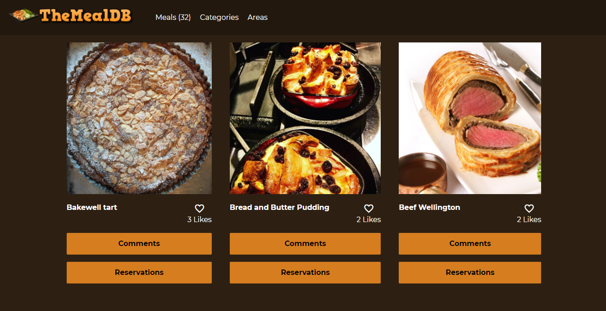

# JavaScript Capstone


> API based webapp



The JavaScript capstone project is about building a web application based on an external API. The API provides data about a specific topic. The web app consist of 2 interfaces.

## Built With

- HTML
- CSS
- JavaScript

## Live Demo

[Live Demo Link](https://usmansbk.github.io/javascript-capstone)

## Getting Started

To get a local copy up and running follow these simple example steps.

### Prerequisites

- NodeJS - [v16.x](https://nodejs.org/en/)

### Setup

```bash
git clone https://github.com/usmansbk/javascript-capstone.git
cd ./javascript-capstone
```

### Install

```bash
npm install
```

### Usage

```bash
npm start
```

### Build

```bash
npm run build
```

### Run tests

```bash
npm test
```

## Authors

👤 **Babakolo Usman Suleiman**

- GitHub: [@usmansbk](https://github.com/usmansbk)
- LinkedIn: [LinkedIn](https://www.linkedin.com/in/usman-suleiman-82b444140/)

👤 **Tolibjon Tolibov**

- GitHub: [@toliboff](https://github.com/toliboff)
- LinkedIn: [LinkedIn](https://linkedin.com/in/tolibjon-tolibov/)

## 🤝 Contributing

Contributions, issues, and feature requests are welcome!

Feel free to check the [issues page](../../issues/).

## Show your support

Give a ⭐️ if you like this project!

## Acknowledgments

- Microverse
- [TheMealDB](https://www.themealdb.com/api.php)
- [Involvement API](https://www.notion.so/Involvement-API-869e60b5ad104603aa6db59e08150270)

## 📝 License

This project is [MIT](./MIT.md) licensed.
